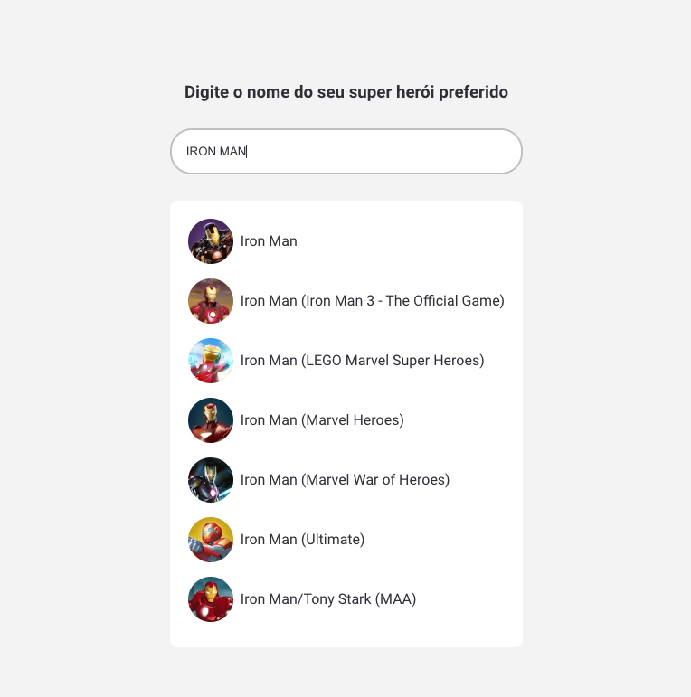
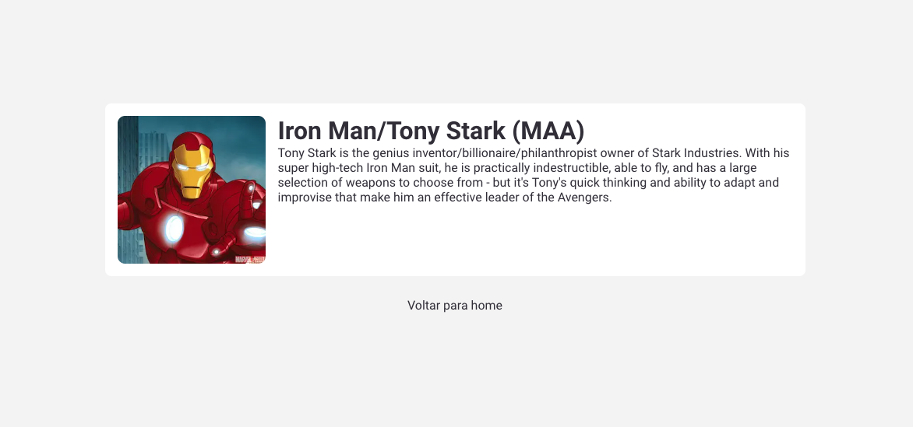

# Curso Full Cycle 3.0

    
    

---

## Descrição

Pequeno estudo da nova versão do Next 13. Entendo o Data Fetching (Client-side Fetching), Dynamic Routes, Api Routes. Uso do Next mais puro possível.

---

## Visualizar o projeto na IDE:

Para quem quiser visualizar o projeto na IDE clique no teclado a tecla `ponto`, esse recurso do GitHub é bem bacana

---

#### Telas do Sistema

    

    

